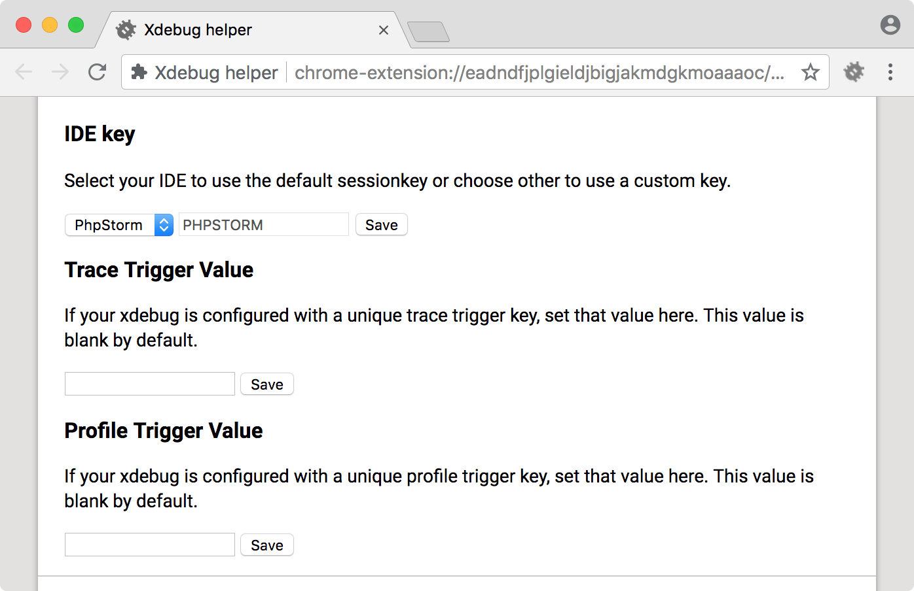
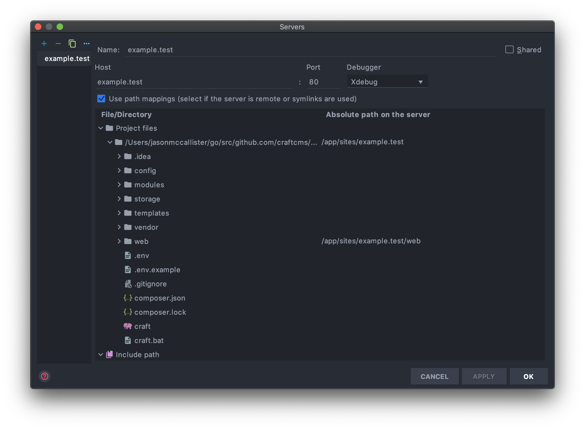
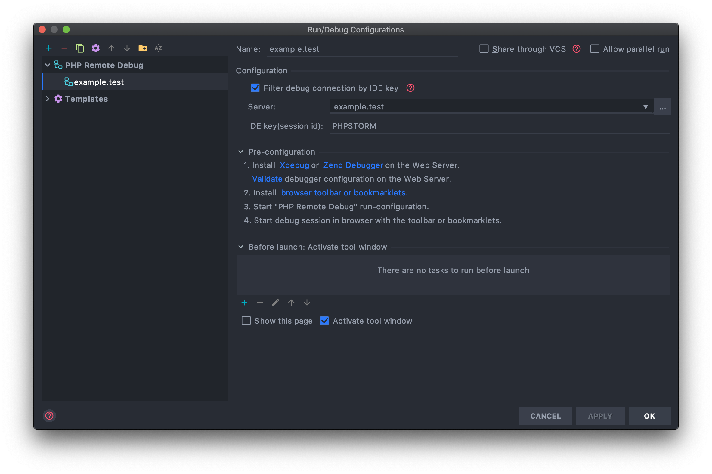
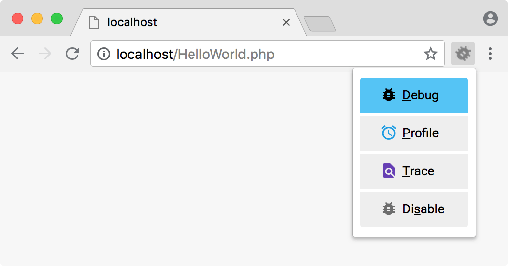

# Using Xdebug with Nitro and PHPStorm

Once you have a machine created, you can run `nitro xdebug on` and `nitro xdebug configure` to enable Xdebug and set it up for automatic remote connections from your host machine. These make the 

## Debugging web requests

Install the Xdebug browser helper in your favorite browser.

- [Chrome](https://chrome.google.com/extensions/detail/eadndfjplgieldjbigjakmdgkmoaaaoc)
- [Firefox](https://addons.mozilla.org/en-US/firefox/addon/xdebug-helper-for-firefox/)
- [Internet Explorer](https://www.jetbrains.com/phpstorm/marklets/)
- [Safari](https://github.com/benmatselby/xdebug-toggler)
- [Opera](https://addons.opera.com/addons/extensions/details/xdebug-launcher/)

Go to the Xdebug browser helper options, choose "PhpStorm" and save.

Create a new server in PhpStorm using your machine's domain name.

Setup path mappings to that `/app/sites/example.test` in your Nitro machine is
mapped to your project's root on your host machine.

Create a new "PHP Remote Debug" configuration and select the server you just created.

Check "Filter debug connection by IDE key" and enter "PHPSTORM" for the IDE key.

Click the "Start Listening for PHP Debug Connections" button in PhpStorm.

Click the "Debug" button on your browser's Xdebug helper.

Then load the site in your browser and whatever breakpoints you've set will be hit.

## Debugging PHP console requests

Do everything above except Xdebug browser helper. SSH into your Nitro machine using
`nitro ssh`, then run your PHP script from the console and any breakpoints you've
set will be hit.